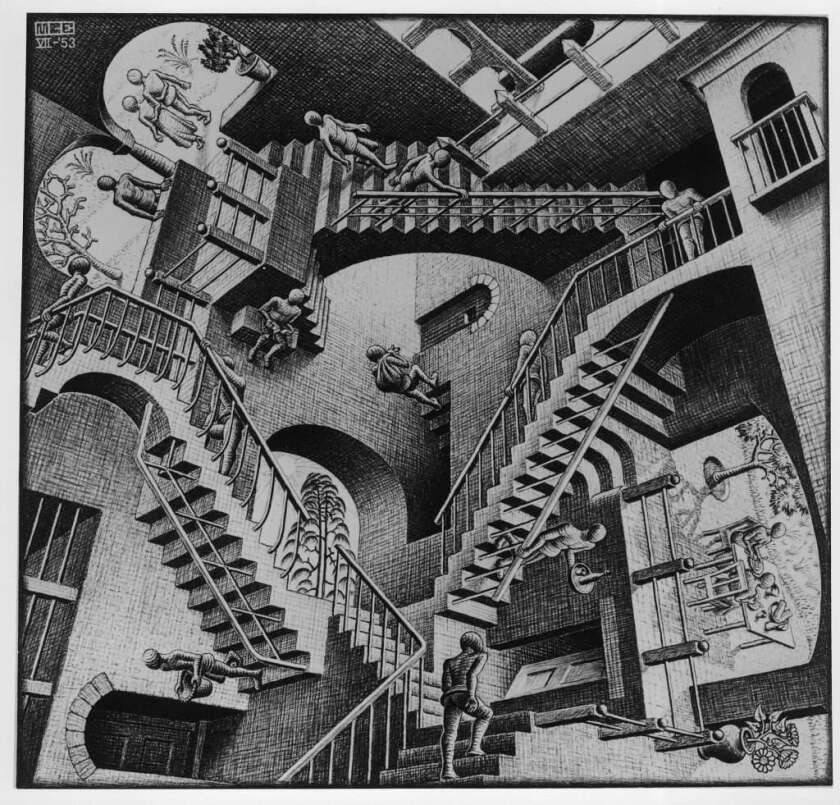

[]("")


# Simulated Annealing Using FastAI Libraries
In this blog post, we'll explore how to use simulated annealing to optimize the learning rate schedule for deep neural network training using FastAI libraries. We'll extend the LRFinder class to include cosine annealing and use the Metric class to calculate accuracy during training.

### What is Simulated Annealing?
Simulated annealing is a global optimization technique that uses a probabilistic approach to find the optimal solution for a given problem. It's inspired by the annealing process in metallurgy, where a material is heated and then cooled slowly to remove defects and achieve a more stable state.

In the context of deep learning, simulated annealing can be used to optimize the learning rate schedule for a model. The idea is to start with an initial learning rate, gradually decrease it over time, and occasionally pause or "anneal" the learning process to allow the model to converge better.

### Cosine Annealing
One popular variant of simulated annealing is cosine annealing. Instead of decreasing the learning rate linearly over time, cosine annealing uses a cosine function to gradually reduce the learning rate. This allows the model to slow down its descent into the optimum and helps prevent getting stuck in local minima.

Here's the formula for cosine annealing:

$$
CurrentLF = StartingRate * (Maxixum(cos(pi * (1 - CurrentSteps/TotalSteps)))
$$

where StartingRate is the initial learning rate, CurrentLF is the learning rate calcuated at the CurrentSteps, and TotalSteps is the total number of steps.

### Implementing Cosine Annealing in FastAI
To incorporate cosine annealing into our FastAI workflow, we'll extend the LRFinder class and add a new method called cosine_annealing. Here's the updated code:
   
```
class LRFinderCB(Callback):
    def __init__(self, lr_mult=1.3):
        super().__init__()
        self.lr_mult = lr_mult
        self.cosine_annealing = False 

    def before_fit(self, learner):
        self.lrs, self.losses = [], []
        self.min = math.inf

    def after_batch(self, learner):
        if not learner.training:
            raise CancelEpochException()

        self.lrs.append(learner.opt.param_groups[0]['lr'])
        loss = to_cpu(learner.loss)
        self.losses.append(loss)
        if loss < self.min:
            self.min = loss

        if self.cosine_annealing:
            learning_rate = self.lr_mult * max(cos(pi * (1 - len(self.lrs) / len(self.losses))), 0.5)
            for g in learner.opt.param_groups:
                g['lr'] = learning_rate
```
The Metric class is used to calculate how far our predictions will be from the targets. 
```
class Metric:
    def __init__(self):
        self.reset()

    def reset(self):
        self.vals, self.ns = [], []

    def add(self, inp, targ=None, n=1):
        self.last = self.calc(inp, targ)
        self.vals.append(self.last)
        self.ns.append(n)

    @property
    def value(self):
        ns = tensor(self.ns)
        return (tensor(self.vals) * ns).sum() / ns.sum()

    def calc(self, inps, targs):
        return (inps == targs).float().mean()

class Accuracy(Metric):
    def calc(self, inps, targs):
        return (inps == targs).float().mean()
```
Now, when we initialize the LRFinderCB object, we can pass cosine_annealing=True to enable cosine annealing. The cosine_annealing method will update the learning rate according to the cosine annealing formula.

### Using the Metric Class to Calculate Accuracy
To calculate accuracy during training, we can use the Metric class provided by FastAI. This class allows us to compute a metric over a dataset and print it out at each epoch.

We'll create a custom accuracy metric that calculates the accuracy of our model on the validation set. Here's how to do it:

from fastai import metrics
```
class Accuracy(metrics.Metric):
    def __init__(self):
        super().__init__()
        self.correct = 0
        self.total = 0

    def add(self, pred, true):
        self.correct += (pred == true).sum().item()
        self.total += pred.size(0)

    def value(self):
        return self.correct / self.total
```
This metric class takes in two tensors, pred and true, which represent the predicted outputs and the true labels, respectively. It then computes the accuracy by counting the number of correctly predicted samples and dividing it by the total number of samples.

We can now register this metric with FastAI's CallbackList to get the accuracy at each epoch:

```
from fastai.callbacks import CallbackList

cb_list = CallbackList()
cb_list.insert(Accuracy())
```
With this callback list, FastAI will call the Accuracy metric at each epoch and print out the accuracy.


### Putting Everything Together
Now that we have all the necessary components, let's put them together to create a complete FastAI training loop with cosine annealing and accuracy calculation:

```
from fastai import TrainLoop

train_loop = TrainLoop(model=model,
                     dataloader=dataloader,
                     optimizer=optimizer,
                     loss_fn=loss_fn,
                     metrics=[Accuracy()],
                     callbacks=[cb_list],
                     device="cuda")
train_loop.train(num_epochs=10)
```

This training loop will train the model for 10 epochs, computing the accuracy at each epoch using the Accuracy metric and updating the learning rate using cosine annealing.

And that's it! With these few lines of code, you've implemented a powerful training loop that leverages the flexibility and ease of use of FastAI.

## Conclusion
In this tutorial, we learned how to implement cosine annealing and accuracy calculation in a FastAI training loop. By extending the LRFinder class and creating a custom Accuracy metric, we were able to create a complete training loop that adapts the learning rate during training and prints out the accuracy at each epoch.

With this knowledge, you can now apply these techniques to your own deep learning projects and improve the performance of your models. Happy coding!